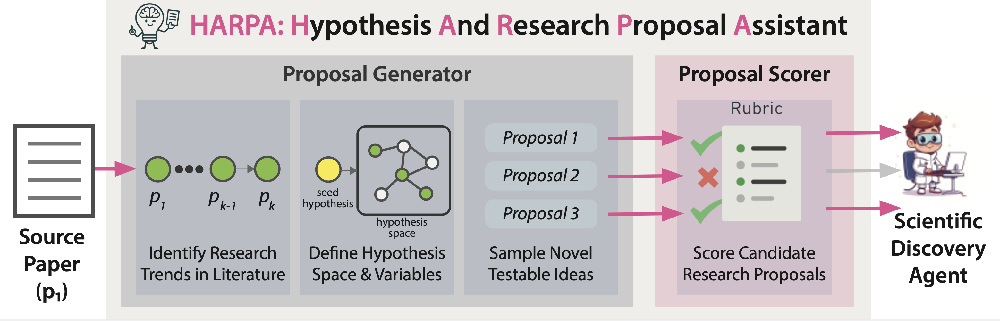

# HARPA: Hypothesis And Research Proposal Assistant

HARPA automatically generates **testable, novel, and literature-grounded research proposals** from scientific papers.  
It is designed to support **AI-assisted hypothesis generation**, connecting prior research to new ideas that can be executed by both human scientists and automated discovery agents.



---

## 🚀 Overview

HARPA consists of two main modules. Click on each module below to view its detailed README or usage instructions:


| Module | Description |
|---------|--------------|
| [**HARPA-Proposal-Generator**](./HARPA-Proposal-Generator/README.md) | Generates structured, literature-grounded research proposals from input papers using retrieval-augmented reasoning. |
| [**HARPA-Scorer**](./HARPA-Scorer/README.md) | Trains and applies a reward model to evaluate proposal quality and reasoning validity using fine-tuned SFT and RLVR pipelines. |


---

`HARPA-Proposal-Generator/ACL_proposals` - Contains HARPA-generated research proposals for 552 highly influential ACL papers, each used as a source paper for hypothesis generation.

`HARPA-Proposal-Generator/UPWORK_proposals` - Contains all HARPA proposals and corresponding baseline proposals that were generated and used for the Upwork expert evaluation study.

---

## 🪶 Citation

If you use this repository, please cite:

Vasu, R., Jansen, P., Siangliulue, P., Sarasua, C., Bernstein, A., Clark, P., & Mishra, B. D. (2025). HARPA: A Testability-Driven, Literature-Grounded Framework for Research Ideation. *arXiv preprint arXiv:2510.00620*.

```bibtex
@article{vasu2025harpa,
  title={HARPA: A Testability-Driven, Literature-Grounded Framework for Research Ideation},
  author={Vasu, R. and Jansen, P. and Siangliulue, P. and Sarasua, C. and Bernstein, A. and Clark, P. and Mishra, B. D.},
  journal={arXiv preprint arXiv:2510.00620},
  year={2025}
}
```